# telc Deutsch B1 / Zertifikat Deutsch

## Testformat
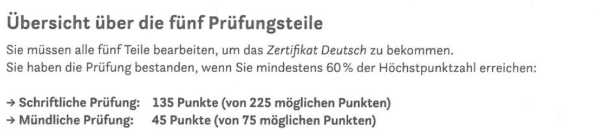
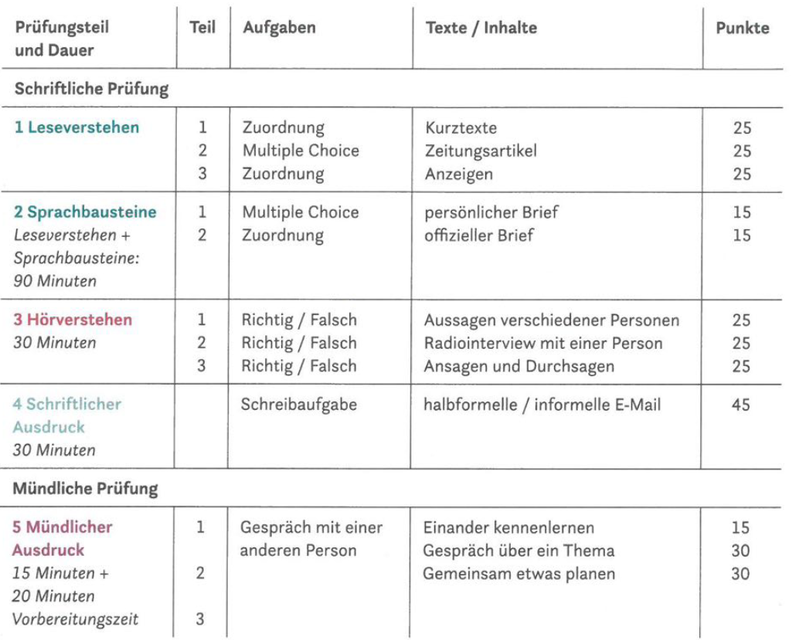

## 1. Leseverstehen + Sprachbausteine (max. 105 Punkte)
### Dauert 90 minuten
- 90 minuten für beide Prüfungsteile (Leseverstehen + Sprachbausteine).
- Fangen mit den Teilen an, die für mich leichter sind.
- Achten auf die wichtigen Informationen - lesen die Texte Wort für Wort NICHT.
- Lesen Sie viel Zeitung - gedruckt oder im Internet.
- !!! Markieren immer eine Losüng, als nichts (die Wahrsheinlichkeit ist höher)

### 1) Leseverstehen (max. 75 Punkte)
#### Dauert ~70 minuten

#### Teil 1 - Globalverstehen - Zuordnung (max. 25 Punkte, ~20 min)
- 5 Texte <-> 10 Überschriften
- 5 Überschriften sind übrig
- Alle Überschriften zu drei Themen
- Notieren die Themen (3 Themen)
- Lesen die Texte und finden die passenden Überschriften
- Streichen die Überschrift durch, wenn sie passt
- !!! Ähnliche oder gleiche Wörter - das ist oft nicht richtige Lösung

#### Teil 2 - Detailverstehen - Multiple Choise (max. 25 Punkte, ~35 min)
- Ein oder zwei Artikel aus Zeitung oder Internet
- Funf Aufgaben - die Wahl zwischen A, B oder C
- Lesen die Überschrift/Thema -> lesen die Aufgabe -> markieren die passenden Sätze im Text
- Die Aufgaben stehen normalerweise in der Reihenfolge des Textes, abet nicht immer!

#### Teil 3 - Selektives Verstehen - Zuordnung (max. 25 Punkte, ~15 min)
- 12 Kleinanzeigen <-> 10 Situationen
- 2 Anzeigen passen zu keiner Situation (sind übrig)
- Die Anzeigen zuerst schnell durchlesen
- Lesen die Situationen nacheinander -> die Schlüsselwörter markieren -> finden die passende Anzeige
- Eine, zwei oder drei Situationen haben keine passende Anzeige -> markieren mit "x"

### 2) Sprachbausteine (max. nur 30 Punkte!)
#### Dauert ~20 minuten

#### Teil 1 - Grammatische Formen - Multiple Choise (max. 15 Punkte, ~10 min)
- 10 Aufgaben zur Grammatik
- Persönlicher Brief mit Lücken
- Die Wahl zwischen A, B oder C
- Versuchen, die Aufgaben spontan zu lösen

#### Teil 2 - Wortschatz und Textverknüpfungen - Zuordnung (max. 15 Punkte, ~10 min)
- 10 Aufgaben zum Wortschatz
- Offizieller/Formeller Brief und Anzeige mit Lücken
- 10 Lücken und 15 Wörter zu auswählen (5 Wörter sind übrig)
- Versuchen, die Aufgaben spontan zu lösen

## 2. Hörverstehen (max. 75 Punkte)
### Dauert 30 minuten

#### Teil 1 - Globalverstehen - Richtig/Falsch (max. 25 Punkte, ~6 min)
- 5 Aufgaben
- 30 sec, um die Aufgaben zu lesen
- Aussagen verschiedener Personen zum einem Thema
- !!! Hören nur einmal

#### Teil 2 - Detailverstehen - Richtig/Falsch (max. 25 Punkte, ~12 min)
- Teil 2 kommt direct nach Teil 1 (15 sec Pause)
- 10 Aufgaben
- 1 min, um die Aufgaben zu lesen + 1 min zwischen Hören + 1 min danach
- Radiointerview oder Gespräch mit einer Person
- Hören zweimal

#### Teil 3 - Selektives Verstehen - Richtig/Falsch (max. 25 Punkte, ~12 min)
- Teil 3 kommt direct nach Teil 2 (15 sec Pause)
- 5 Aufgaben
- Nachrichten, Ansagen oder Durchsagen (kurze Texte)
- Hören zweimal

#### Praxis
- https://b1-deutsch.com

## 3. Schriftlicher Ausdruck (max. 45 Punkte)
### Dauert 30 minuten

#### Schreibaufgabe (nur ein Teil)
- Informelle (Du/du) oder halbformelle (Sie) E-Mail
- 4 Leitpunkten
- Maximal 150 Wörter
- Was ist bewertet
  - Der Inhalt (max. 5 Punkte x 3)
  - Die Kommunikative Gestaltung (max. 5 Punkte x 3)
  - Die formale Richtigkeit (max. 5 Punkte x 3)
- E-Mail besteht aus 4 Teilen
  - Anrede
  - Einleitung
  - Schlusssatz
  - Gruß
- TIPPS
  - Machen Abschnitte
  - Beginnen nicht immer mit dem Subject (die Satzanfänge variiert)
    - Beginne mit: außerdem, vieleicht, gern, natürlich oder mit einem Nebensatz
  - Schreiben nict nur in Hauptsätzen (HS + NS verwenden)
- Prüfen
  - Nach **dass, weil, als, obwohl** -> das Verb steht am Satzende (+ Komma)
  - **Deshalb, trotzdem** -> stehen allein vor dem Verb
  - **Und, denn** -> stehen vor dem ersten Satzteil
  - Ob alle Verben in der richtigen Form sind
  - Ob alle Nomen großgeschrieben sind
- Nützliche Ausdrücke
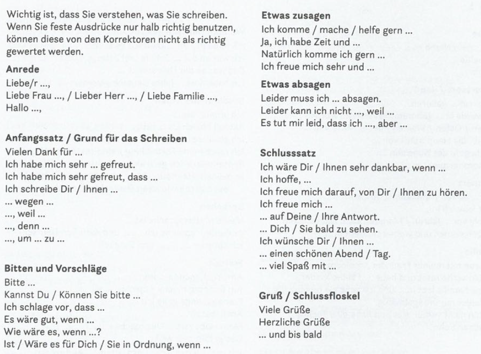
- Persönlicher Brief
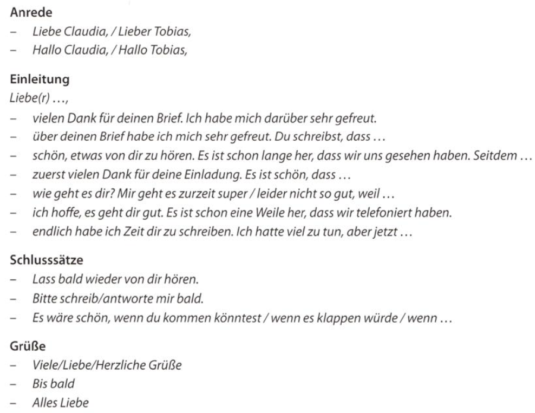
- Halbformeller Brief
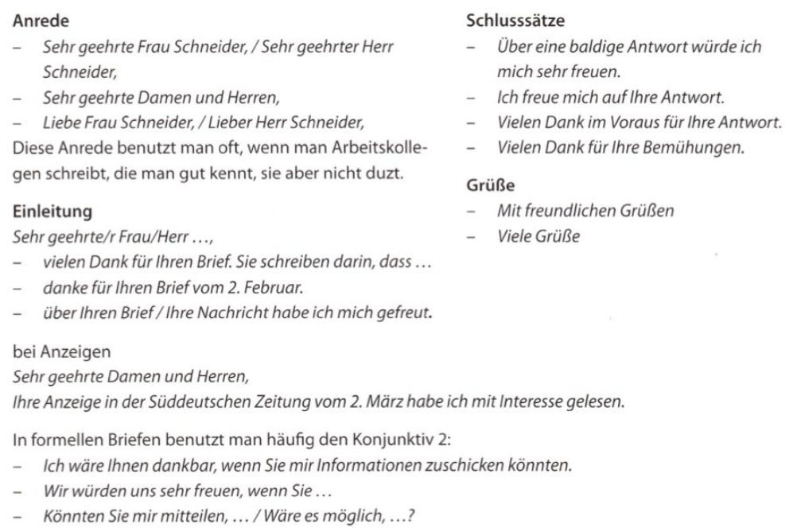
- [Die Beispiele](schreiben_beispiele.md)

#### Links
- https://ifu-institut.at/online-lernen/prufungsvorbereitung/prufungsvorbereitung-b1/schreiben/primery-pisem-na-razlichnye-temy-dlia-urovnia-b1
- https://quizlet.com/de/karteikarten/b1-redemittel-schriftlicher-ausdruck-279645799

## 4. Mündlicher Ausdruck 
### Dauert 35 minuten (20 für die Vorbereitung + 15 für die Prüfung)

#### Teil 1 - Einander kennenlernen / Über mich (max. 15 Punkte, ~3 min)
- Aufgabenblatt mit Fragen zu Person
- Vorbereiten und zu Hause im Voraus lernen
- Mögliche Zusatzthemen für Prüfende sind
  - Wie er od er sie das Wochenende verbringt
  - Welche Hobbys er oder sie hat
- Nützliche Ausdrücke
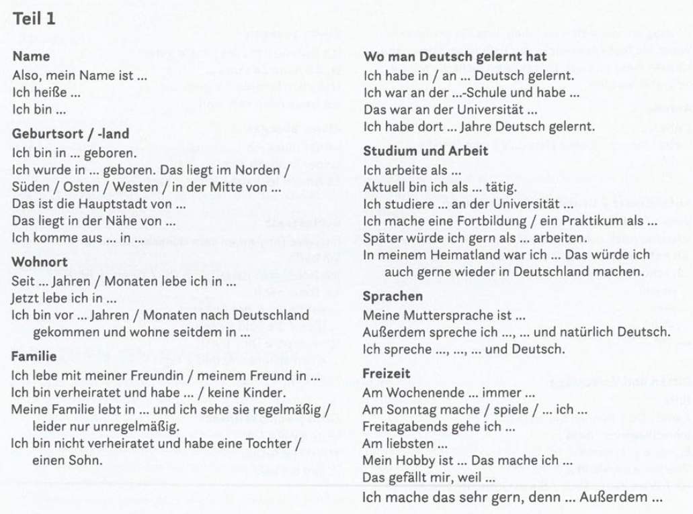
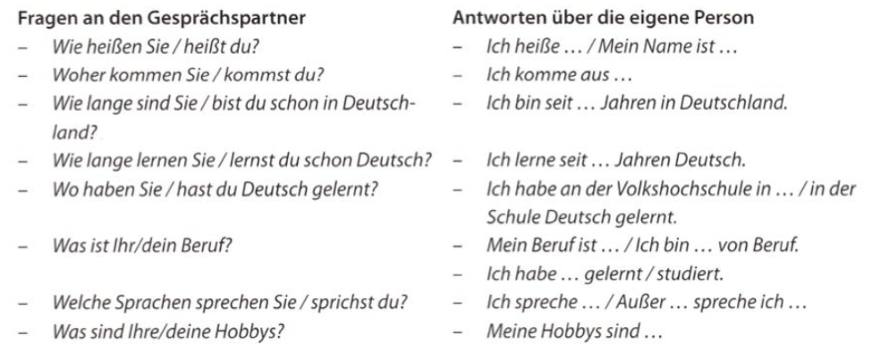
- Mein Vorstellung
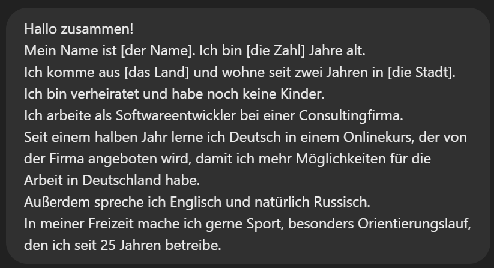
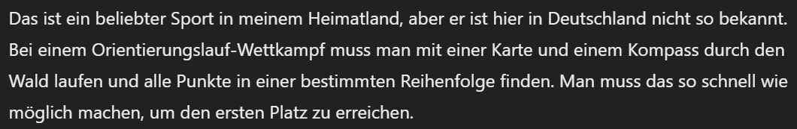

#### Teil 2 - Gespräch über ein Thema (max. 15 Punkte, ~6 min)
- Aufgabenblatt mit einem Text/Foto oder eine Grafik
- Nützliche Ausdrücke

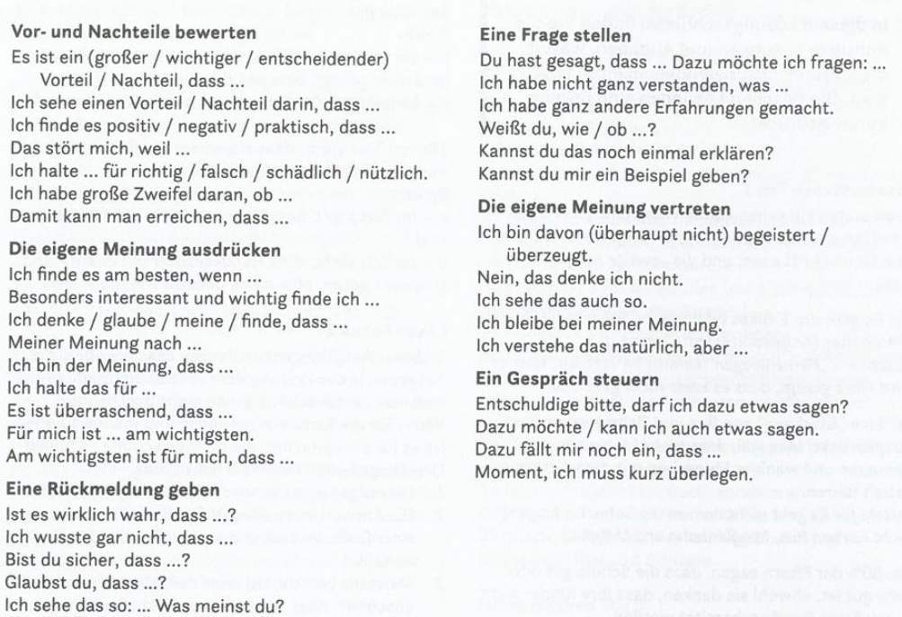
- Grafik
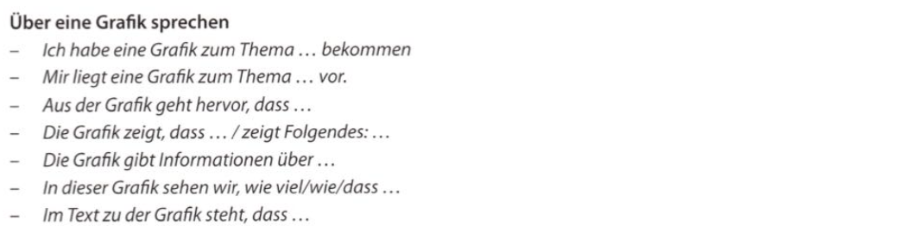
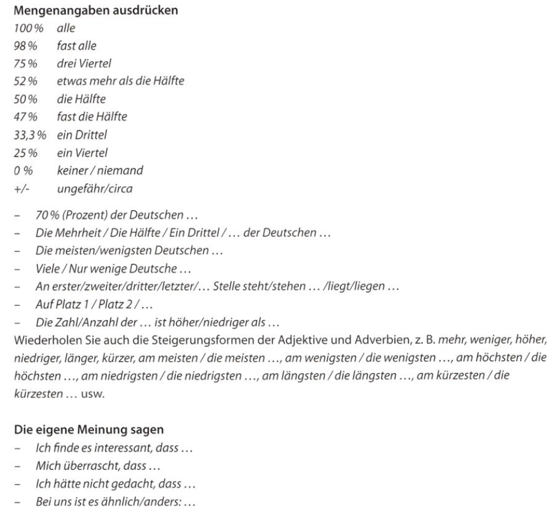
- Stellungnahme zu einem Thema
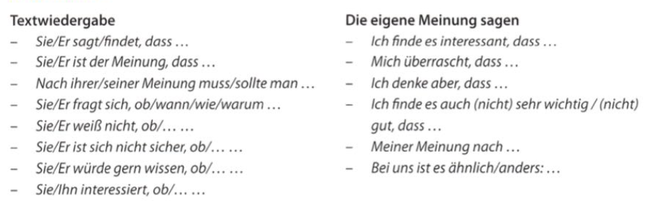

#### Teil 3 - Gemeinsam etwas planen / Dialog (max. 15 Punkte, ~6 min)
- Aufgabenblatt mit einer Situation und Stichpunkten dazu
- Redemittel: https://www.wattpad.com/126795221-deutsch-lernen-b1-redemittel-um-etwas-zusammen-zu
- Nützliche Ausdrücke
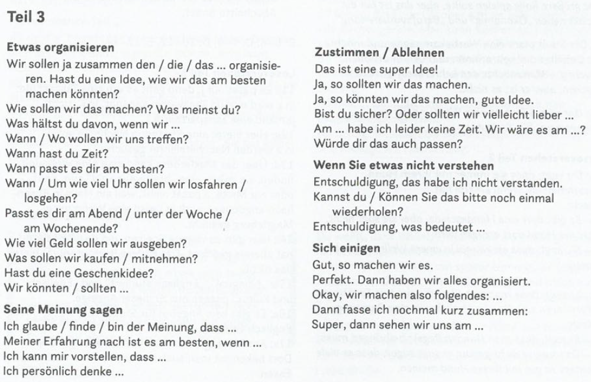
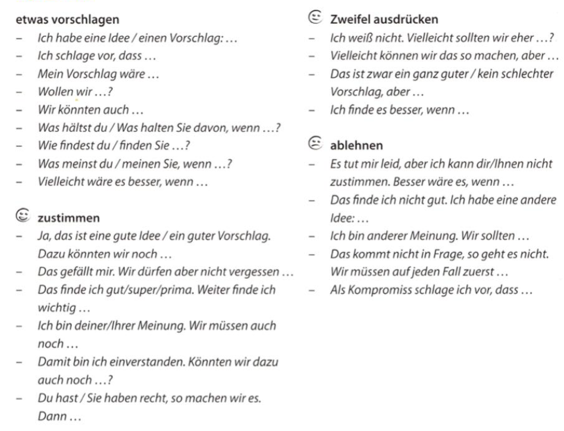

## Wortschatz
- [Quizlet](https://quizlet.com/ch/417069360/telc-b1-wortschatz-flash-cards)
- [TELC_Einfach_gut_B1_Wortschatzliste](https://www.telc.net/fileadmin/user_upload/Downloads_Verlag/Einfach_gut/Wortschatzlisten/Einfach_gut_B1_Wortschatzliste_alphabetisch.pdf)

## Links
- https://b1-deutsch.com
- https://gfarmak.wordpress.com/2011/02/16/redemittel-b1
- https://github.com/ajeyln/deutsch_lernen
- https://www.youtube.com/@BenjaminDerDeutschlehrer
