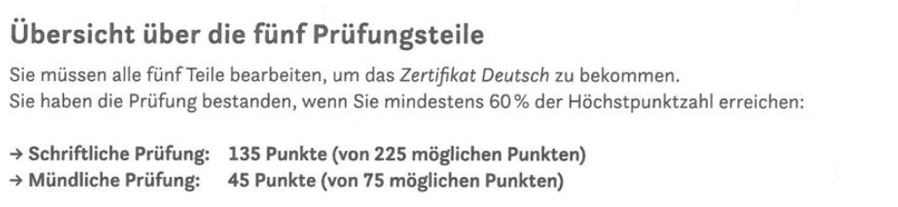

# telc Deutsch B1 / Zertifikat Deutsch

## Testformat

## 1. Leseverstehen + Sprachbausteine (max. 105 Punkte)
### Dauert 90 minuten
- 90 minuten für beide Prüfungsteile (Leseverstehen + Sprachbausteine).
- Fangen mit den Teilen an, die für mich leichter sind.
- Achten auf die wichtigen Informationen - lesen die Texte Wort für Wort NICHT.
- Lesen Sie viel Zeitung - gedruckt oder im Internet.
- Markieren immer eine Losüng, als nichts (die Wahrsheinlichkeit ist höher)!

### 1) Leseverstehen (max. 75 Punkte)

#### Teil 1 - Zuordnung (max. 25 Punkte)
- 5 Texte (Kurztexte) und 10 Überschriften (5 Überschriften sind übrig)

#### Teil 2 - Multiple Choise (max. 25 Punkte)
- Zeitungsartikel

#### Teil 3 - Zuordnung (max. 25 Punkte)
- Anzeigen

### 2) Sprachbausteine (max. nur 30 Punkte!)

#### Teil 1 - Multiple Choise (max. 15 Punkte)
- Persönlicher Brief

#### Teil 2 - Zuordnung (max. 15 Punkte)
- Offizieller Brief

## 2. Hörverstehen (max. 75 Punkte)
### Dauert 30 minuten

#### Teil 1 - Richtig/Falsch (max. 25 Punkte)
- Aussagen verschiedener Personen

#### Teil 2 - Richtig/Falsch (max. 25 Punkte)
- Radiointerview mit einer Person

#### Teil 3 - Richtig/Falsch (max. 25 Punkte)
- Ansagen und Durchsagen

#### Praxis
- https://b1-deutsch.com

## 3. Schriftlicher Ausdruck (max. 45 Punkte)
### Dauert 30 minuten

#### Schreibaufgabe
- Informelle oder halbformelle E-Mail

#### Links
- https://ifu-institut.at/online-lernen/prufungsvorbereitung/prufungsvorbereitung-b1/schreiben/primery-pisem-na-razlichnye-temy-dlia-urovnia-b1
- https://quizlet.com/de/karteikarten/b1-redemittel-schriftlicher-ausdruck-279645799

## 4. Mündlicher Ausdruck 
### Dauert 35 minuten (20 für die Vorbereitung + 15 für die Prüfung)

#### Teil 1 - Einander kennenlernen / Über mich (max. 15 Punkte)
- Vorbereiten und zu Hause im Voraus lernen

#### Teil 2 - Gespräch über ein Thema (max. 15 Punkte)
- Oder Bild beschreiben???

#### Teil 3 - Gemeinsam etwas planen / Dialog (max. 15 Punkte)
- Redemittel: https://www.wattpad.com/126795221-deutsch-lernen-b1-redemittel-um-etwas-zusammen-zu

## Wortschatz 

- [Quizlet](https://quizlet.com/ch/417069360/telc-b1-wortschatz-flash-cards)
- [TELC_Einfach_gut_B1_Wortschatzliste](https://www.telc.net/fileadmin/user_upload/Downloads_Verlag/Einfach_gut/Wortschatzlisten/Einfach_gut_B1_Wortschatzliste_alphabetisch.pdf)

## Links
- https://b1-deutsch.com
- https://gfarmak.wordpress.com/2011/02/16/redemittel-b1
- https://github.com/ajeyln/deutsch_lernen
